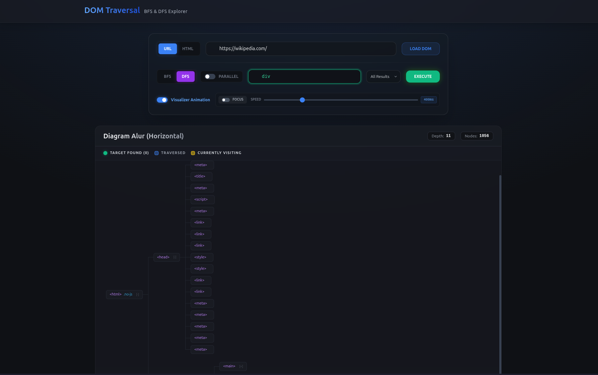

# Tubes2_e621

> Tugas Besar 2 IF2211 Strategi Algoritma

`Penerapan Algoritma BFS dan DFS dalam Mekanisme Penelusuran CSS pada pohon Document Object Model`

<p align="center">  </p>

---

## Daftar Isi

- [Deskripsi Singkat](#deskripsi-singkat)
- [Algoritma BFS dan DFS](#algoritma-bfs-dan-dfs)
- [Requirement](#requirement)
- [Quick Start](#quick-start-docker)
- [Instalasi dan Build](#instalasi-dan-build-manual)
- [Struktur Proyek](#struktur-proyek)
- [Author](#author)

## Deskripsi Singkat

Proyek ini mengimplementasikan pencarian pada penelusuran identitas komponen (_CSS Selectors_) di dalam pohon **Document Object Model (DOM)** pada suatu dokumen HTML yang diberikan (dapat berupa tautan tautan _website_ maupun kode HTML mentah). Mesin algoritma inti dibentuk menggunakan dua metode algoritma pencarian visual: **Breadth-First Search (BFS)** secara menyamping lapis demi lapis dan **Depth-First Search (DFS)** secara menelusur kedalaman cabang demi cabang.

## Algoritma BFS dan DFS

### Breadth-First Search (BFS)

BFS adalah algoritma penelusuran graf yang menjelajahi simpul-simpul secara **menyamping lapis demi lapis** (_level-order_). Dimulai dari simpul akar (root), BFS mengunjungi seluruh simpul pada kedalaman saat ini sebelum berpindah ke kedalaman berikutnya. Struktur data utama yang digunakan adalah **antrian (queue)**.

Dalam proyek ini, BFS diimplementasikan pada file `src/backEnd/algorithms/BfsAlgorithm.cs` dengan pendekatan **paralel** menggunakan `ConcurrentQueue` dan `Parallel.ForEach`. Alur kerjanya:

1. Simpul akar dimasukkan ke dalam antrian.
2. Seluruh simpul pada level saat ini di-_dequeue_ dan diproses secara paralel.
3. Setiap simpul yang diproses akan memasukkan anak-anaknya ke dalam antrian untuk diproses pada iterasi berikutnya.
4. Proses berulang hingga antrian kosong atau jumlah hasil yang diminta telah tercapai (_early termination_).

BFS cocok digunakan untuk menemukan elemen yang **paling dekat** dengan akar karena menjamin bahwa elemen pada kedalaman lebih dangkal selalu ditemukan terlebih dahulu.

### Depth-First Search (DFS)

DFS adalah algoritma penelusuran graf yang menjelajahi simpul-simpul secara **mendalam cabang demi cabang**. Dimulai dari simpul akar, DFS menelusuri satu cabang hingga mencapai simpul daun (_leaf_) sebelum melakukan _backtrack_ dan menelusuri cabang lainnya. Struktur data utama yang digunakan adalah **stack**, baik secara eksplisit maupun melalui rekursi.

Dalam proyek ini, DFS diimplementasikan pada file `src/backEnd/algorithms/DfsAlgorithm.cs`. Alur kerjanya:

1. Simpul akar dimasukkan ke dalam stack.
2. Simpul teratas di-_pop_ dan diproses, kemudian anak-anaknya dimasukkan ke dalam stack.
3. Proses berulang hingga stack kosong atau jumlah hasil yang diminta telah tercapai.

DFS cocok digunakan untuk menelusuri struktur pohon yang dalam atau ketika elemen yang dicari berada di **cabang-cabang terdalam** dari pohon DOM.

## Requirement

| Komponen                      | Keterangan / Versi Minimum                      |
| ----------------------------- | ----------------------------------------------- |
| **Node.js & NPM**             | v18.0 atau yang lebih baru                      |
| **HTML, CSS, dan JavaScript** | ES6+ Standard                                   |
| **React**                     | v18.0+                                          |
| **C#**                        | C# 12.0                                         |
| **.NET SDK**                  | versi 10.0                                      |
| **Sistem Operasi**            | Windows / Linux (WSL)                           |
| **Docker** (Opsional)         | v20.0+                                          |

## Quick Start (Docker)

Cek instalasi:

```bash
docker --version
docker compose version
```

### 1. Menjalankan Aplikasi

Dari root project (`/Tubes2_e621`), masuk ke folder source dan jalankan compose:

```bash
cd src
docker-compose up -d --build
```

### 2. Akses Aplikasi

Setelah berhasil dijalankan:

- Frontend: http://localhost:5173
- Backend API (Health/Root): http://localhost:5027/api/scrape

atau dengan IP Network yang tertera pada terminal

### 3. Menghentikan Aplikasi

```bash
docker compose down
```

## Instalasi dan Build (manual)

### 1. Menjalankan Front End Program (React UI)

Dari direktori akar (`/Tubes2_e621`), masuk dan nyalakan antarmuka visual penelusuran.

```bash
# Berpindah ke direktori React
cd src/frontEnd

# Menginstal sekumpulan dependensi yang dibutuhkan
npm install

# Menyalakan program Visualizer di localhost:5173
npm run dev
```

### 2. Menjalankan Back End Program (API C#)

Buka layar Terminal baru. Dari direktori akar (`/Tubes2_e621`), masuk dan nyalakan _server backend_ penelusur algoritma pohon DOM.

```bash
# Berpindah ke direktori ASP.NET Core
cd src/backEnd

# Mengecek kompatibilitas versi .NET di terminal Anda
dotnet --version
# Sesuaikan versi jika tidak sesuai

# Jalankan server API (Port 5027)
dotnet run
```

## Struktur Proyek

```text
Tubes2_e621/
├── README.md                      # Dokumentasi Proyek Induk
├── doc/                           # Berkas Penyajian Laporan & Dokumen Tugas
│   └── ...                        # Laporan spesifikasi atau PDF pendukung
└── src/
    ├── compose.yaml               # Docker compose
    ├── backEnd/                   # Source Code C# API Framework Backend
    │   ├── controllers/
    │   ├── models/
    │   ├── services/
    │   ├── backEnd.csproj
    │   ├── Dockerfile             # File docker
    │   └── Program.cs             # Bootstrapper Pintu Masuk Lokal
    │
    └── frontEnd/                  # Source Code React Aplikasi Antarmuka Visual (Vite)
        ├── src/
        │   ├── components/
        │   ├── services/
        │   ├── App.jsx
        │   └── App.css
        ├── package.json
        ├── Dockerfile
        └── vite.config.js
```

### Link Deployment

[Microsoft Azure (Live)](https://domtraversal-ggdaepatgnhzbbaz.indonesiacentral-01.azurewebsites.net)

### Author

- 13524038 An-Dafa Anza Avansyah [(about me)](https://github.com/An-Dafa)
- 13524053 Muhammad Haris Putra Sulastianto [(about me)](https://mhps-null.vercel.app/)
- 13524059 Raymond Jonathan Dwi Putra J [(about me)](https://github.com/Alpaomega1136)

Teknik Informatika, Institut Teknologi Bandung — 2026
